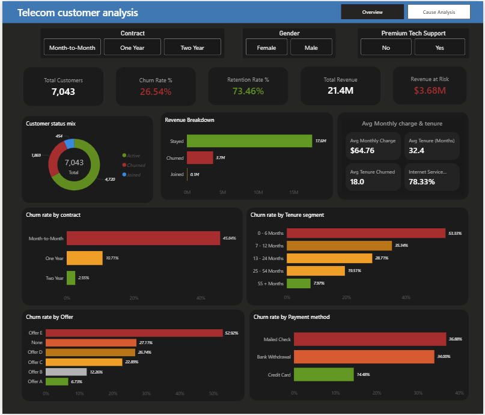

# 📊 Telecom Customer Churn Analysis

> 🚀 Identifying key drivers of churn and delivering data-driven retention strategies

---

## ⚡(Quick Summary)

- 📉 **High churn from month-to-month customers (88%)**
- ⏳ **Early churn (0–6 months) is critical**
- ⚔️ **45% churn due to competitors**
- ⚠️ **Service & support issues = major internal driver**
- 💡 Built actionable strategies to improve retention

---

## 📌 Business Problem
The telecom company is facing **high customer churn (~3.6M revenue loss)**, impacting revenue and customer lifetime value.

---

## 🎯 Objective
- Identify key churn drivers  
- Analyze high-risk customer segments  
- Provide actionable retention strategies  

---

## 🧠 Approach
✔ Data Cleaning (Excel)  
✔ SQL Analysis  
✔ Exploratory Data Analysis (EDA)  
✔ Customer Segmentation  
✔ Power BI Dashboard  

---

## 📊 Key Insights

- 🔴 **88% churn → Month-to-month contracts**
- 🔴 **Highest churn → 0–6 months customers**
- 🔴 **~45% → Competitor-driven churn**
- 🔴 **~45% → Service & support issues**
- 🟡 No-offer customers show higher churn  
- 🟡 Senior citizens (55+) are high-risk  
- 🟡 Fiber optic users show dissatisfaction  

---

## ⚠️ Key Business Gaps

- ❌ Weak customer retention strategy  
- ❌ Poor onboarding experience  
- ❌ Service quality issues  
- ❌ Ineffective offers  

---

## 💡 Recommendations

- ✅ Convert users to **3–6 month plans**  
- ✅ Improve **first 90-day onboarding**  
- ✅ Fix **customer support experience**  
- ✅ Provide **personalized offers**  
- ✅ Target **high-risk segments**  
- ✅ Optimize **payment methods**  

---

## 📈 Business Impact (Expected)

📉 Reduced churn rate  
📈 Improved customer retention  
💰 Increased revenue stability  

---

## 📊 Dashboard Preview

---

## 🛠 Tech Stack

- 📊 Excel   
- 📈 Power BI  

---

## 🚀 Conclusion

Churn is driven by **low commitment, poor early experience, and competitive pressure**.  
Targeted strategies can significantly improve retention and business performance.

---
